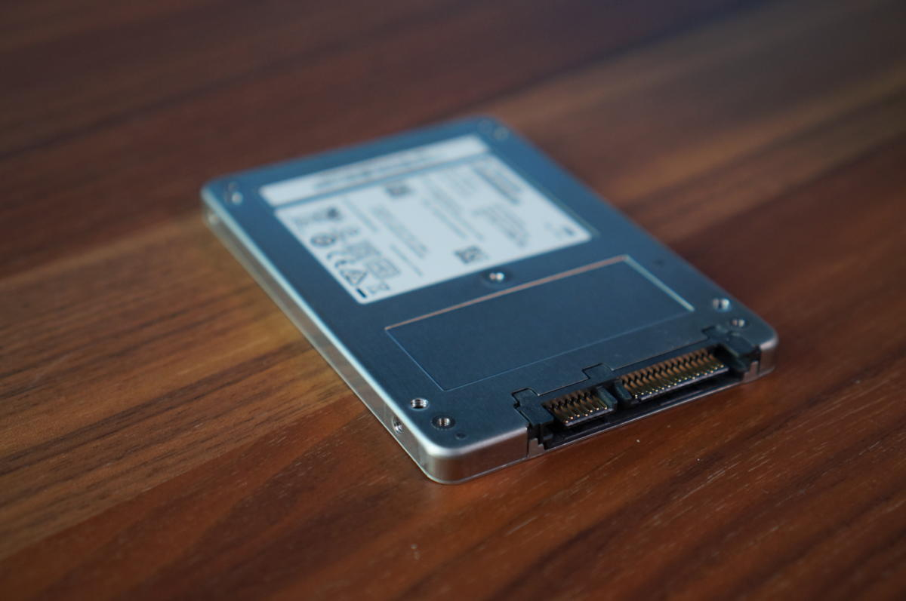
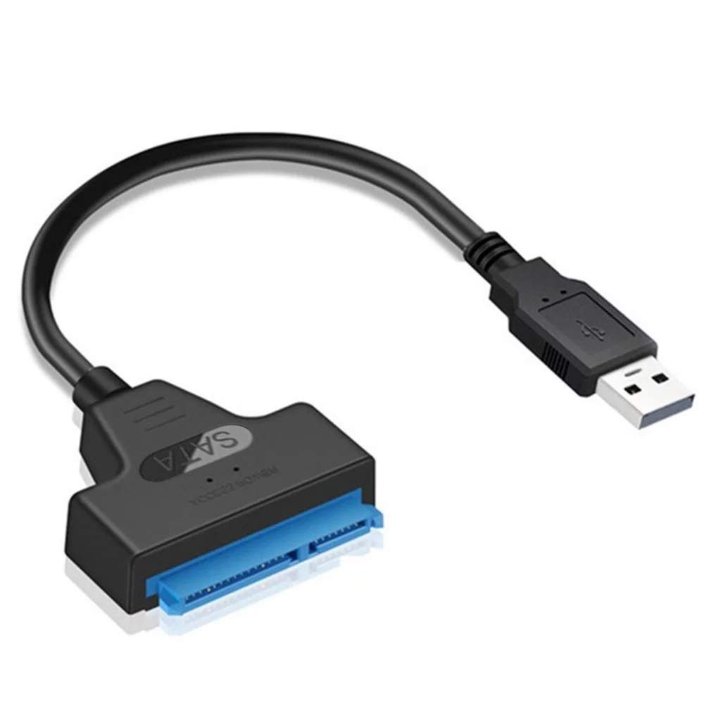
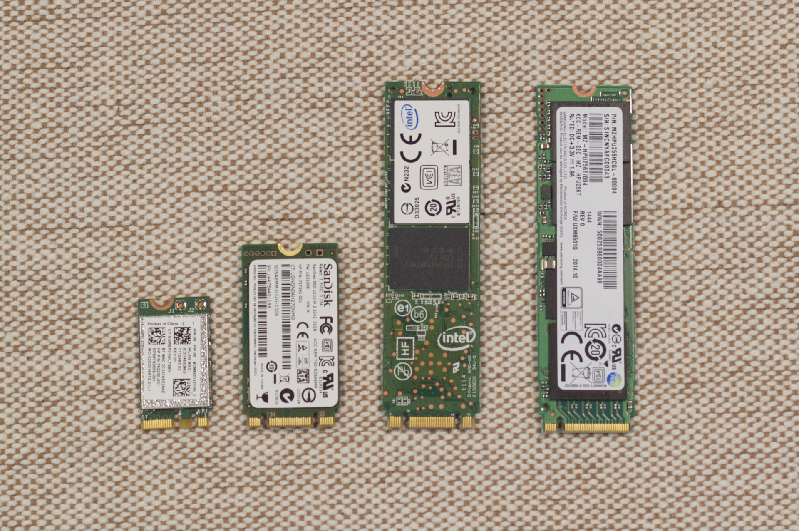

# PiDeviceSSD
Transition to using a SSD on your Pi alternative single board computer (SBC) based on the Allwinner H616 chip

## Overview
The goal of this guide is to transition away from using the MicroSD card as a boot / storage device and instead use a more reliable (and likely faster) SSD. This is well documented for official Raspberry Pi devices, but as more alternative SBC are made available for 3D printing, these Pi guides don't work.

This is focused on the Allwinner H616 chip system that we find in the Bigtreetech CB1, Bigtreetech Pi, and Mellow Fly Pi devices. They are very similar to the popular Orange Pi Zero 2 SBC.

This guide references an Orange Pi Zero 2 guide, that you can see [here](https://jamesachambers.com/orange-pi-zero-2-usb-ssd-boot-guide/ "Orange Pi Zero 2 USB SSD Boot Guide"). Thanks to James A. Chambers for a great guide!

## Why!?
Why not!? MicroSD cards can corrupt and fail and are not the most reliable daily driver for storage. Saying that, I've never had one fail...

The idea is that a USB connected SSD is more reliable and can be faster. But there is a catch...the Allwinner H616 devices designed for 3D printing are limited to USB2.0 speeds. So ultra fast read and write speeds aren't expected. On that note, using a NVMe M.2 SSD is a complete waste for this setup.

## Understanding the Hardware
First, lets understand what we are doing at a high level.

The MicroSD card has two partitions: boot and storage. The boot partition gets the SBC and software up and running, and points to the storage partition to get the OS running and data accessible. Each are addressable by a unique identifier called a UUID...sound familiar for the CAN bus adopters?

The idea is that we copy the storage / data partition to the USB SSD. Then give this copied partition the same UUID as the original storage partition (on the MicroSD). Now we assign a random UUID to the original partition. So upon power up the BOOT partition says "Hey, this is the UUID for the OS / storage...use it!" but that UUID is actually on the USB SSD...

Note: The Mellow Fly Pi only has a single partition on the MicroSD card. This is identical to the referenced guide for the Orange Pi Zero 2. As of writing this guide I have only tried this on the 2 partition setup with Bigtreetech products. But I have confidence it will work with Mellow since it is identical to the Orange Pi...

Finally, we have to keep using the MicroSD card. We can't transfer everything to the SSD. The Allwinner H616 hardware locks us to using the BOOT partition on the MicroSD card. It will not start up without a MicroSD card present. But now we rarely access the SD card...only on boot.

### Note on SSD Selection
Since we are limited to USB2.0 speeds, a simple SATA SSD will work. These can be either an M.2 SSD (in an enclosure with a controller) or the very popular 2.5" SATA SSD with a USB to SATA adapter. Below are are few examples.

Note, do not use a USB thumb drive or NVMe M.2 SSD. The thumb drive can easily corrupt and run slower than the MicroSD card. The NVMe M.2 SSD will only run at USB2.0 speeds and thus is a waste...

<picture>
  
</picture>
Above: 2.5" SATA SSD

<picture>
  
</picture>
Above: USB to SATA adapter

<picture>
  
</picture>
Above: Various M.2 SSD options, without enclosures

## Instructions
Finally!

This guide assumes you have your Linux OS installed and running properly.

First, power up your SBC device and plug in the USB SSD.
SSH into the SBC with your favourite terminal application.

```
sudo lsblk
```


